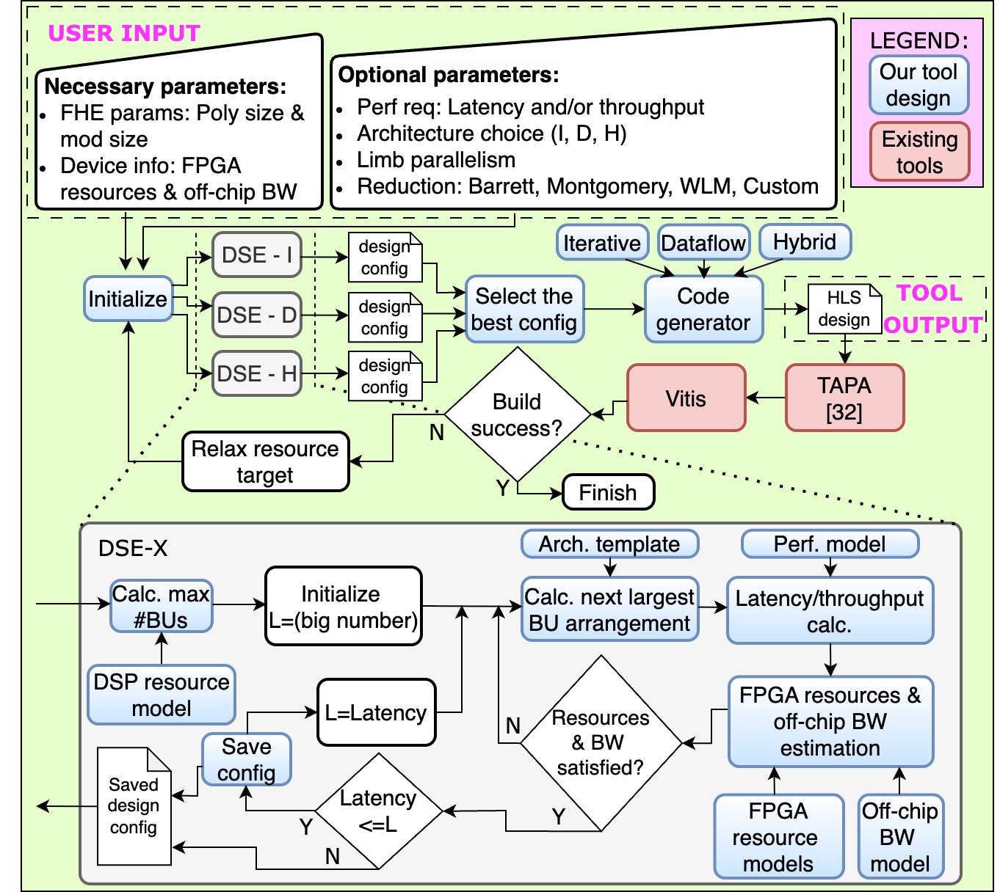

# AutoNTT

**Automatic Architecture Design and Exploration for Number Theoretic Transform Acceleration on FPGAs**

AutoNTT is a design automation framework for generating and exploring efficient FPGA architectures for the Number Theoretic Transform (NTT). It enables automatic design space exploration, code generation using HLS, and integration with FPGA toolchains. [Paper](https://ieeexplore.ieee.org/document/11008967)

<div align="center">
  
</div>

---

## System Requirements

- **Python 3**: AutoNTT has been extensively tested with Python 3.6.9.
- **[TAPA](https://github.com/UCLA-VAST/tapa)/[Pasta](https://github.com/SFU-HiAccel/pasta)**: AutoNTT designs are developed using the TAPA framework for task-parallel programming. Users can either [install TAPA](https://github.com/UCLA-VAST/tapa?tab=readme-ov-file#:~:text=Documentation-,Installation,-Hello%20World) or [install Pasta](https://github.com/SFU-HiAccel/pasta#installation), which is an extension of TAPA. AutoNTT has been extensively tested with TAPA version 0.0.20240104.2.
- **AMD/Xilinx Tools**: TAPA relies on AMD/Xilinx Vitis and Vivado. AutoNTT has been tested with Vitis and Vivado version 2023.2.

**Note**: TAPA/Pasta, Vitis, and Vivado are **only required** when:
1. A custom reduction method is passed to the automation framework.
2. You plan to build and run the generated hardware design.
These tools are **not required** for design space exploration (DSE) and code generation using default reduction methods.

---

## Usage

### DSE and code generation

Example command with mandatory inputs:

```bash
cd automation_framework
python3 AutoNTT.py --poly_size 4096 --mod_size 48 --resources fpga_resources.json
```
Descriptions of important inputs are provided below.

Tool output:

Upon a successful run, the generated design code will be written to the following directory: `tool_outputs/<design_name>/`

### Build the design and run

C simulation:

```bash
make csim
```
Tapa run with floorplanning:

```bash
make tapa_wi_floorplan
```

Build the design using Vivado:

```bash
make build_hw
```

Run design on FPGA:

```bash
make run_hw
```

---

## Important Inputs

To view all available command-line options:

```bash
python3 AutoNTT.py --help
```

Mandatory Inputs:

- `--poly_size`: Specifies the target polynomial size **N**.  
- `--mod_size`: Specifies the modulus (i.e., prime) bit-width **log_q**.  
- `--resources`: Specifies the target device resources (see the provided `fpga_resources.json` as a template).  

Optional Inputs:

- `--latency_target`: Specifies a latency target (in milliseconds) for the design space exploration (DSE).
- `--throughput_target`: Specifies a throughput target (in NTTs per second) for the design space exploration (DSE).
- `--arch_type`: Restricts the design space exploration to specific architecture(s).
- `--parallel_limbs`: Requests the generation of designs supporting the specified number of parallel limbs.  
- `--modmul_type`: Specifies the modulo reduction method. Supported values:
  - `B` = Barrett (default)  
  - `M` = Montgomery  
  - `WLM` = Word-Level Montgomery  
  - `N` = Naive  
  - `C` = Custom  
- `--wlm_word_size`: Specifies the word size for Word-Level Montgomery (WLM). This affects resource usage and latency of the WLM modulo reduction.  
- `--custom_mod_kernel`, `--custom_mod_host`, `--custom_mod_header`, `--custom_mod_interface`:  
  Provide the corresponding custom modulo reduction components when using `--modmul_type C`.  
  Please refer to the documentation here for details on how to use these switches.  
- `--verbose`: Increases verbosity level for debugging purposes.

---

## Publication

AutoNTT work has been published at FCCM 2025.
>D. Kumarathunga, Q. Hu and Z. Fang, "AutoNTT: Automatic Architecture Design and Exploration for Number Theoretic Transform Acceleration on FPGAs," 2025 IEEE 33rd Annual International Symposium on Field-Programmable Custom Computing Machines (FCCM), Fayetteville, AR, USA, 2025, pp. 1-9, doi: 10.1109/FCCM62733.2025.00024.
