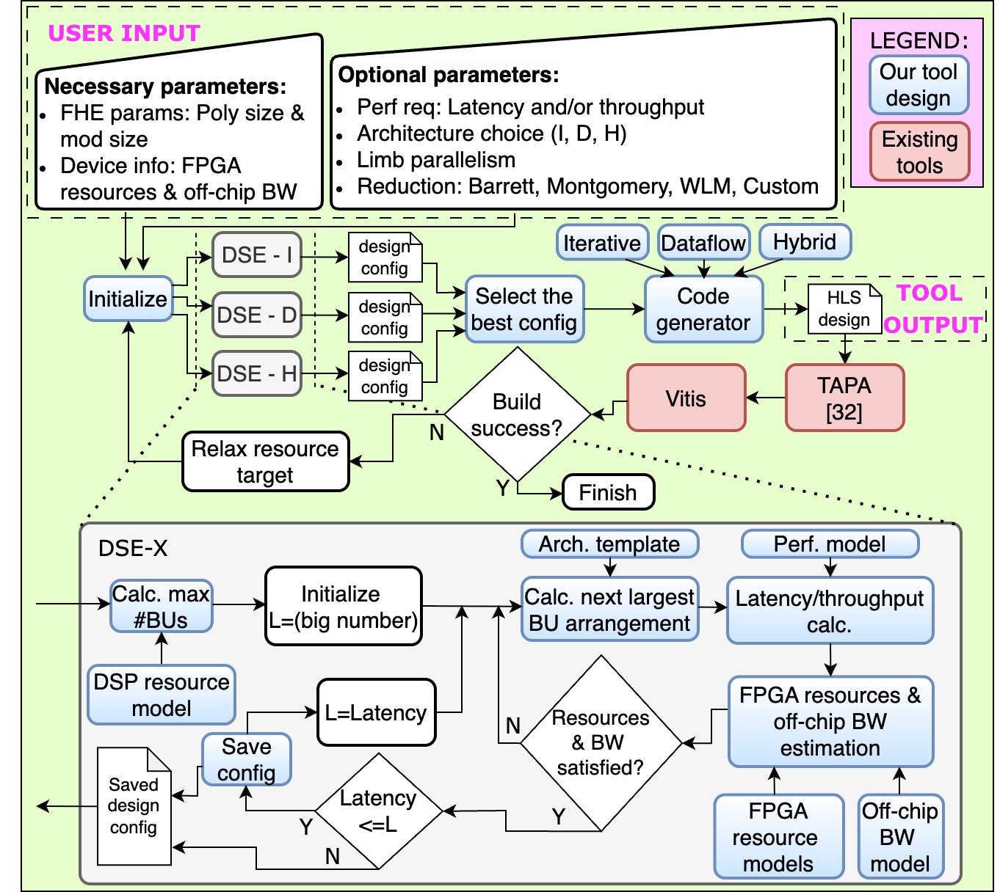

# AutoNTT

**Automatic Architecture Design and Exploration for Number Theoretic Transform Acceleration on FPGAs**

AutoNTT is a design automation framework for generating and exploring efficient FPGA architectures for the Number Theoretic Transform (NTT), targeting Fully Homomorphic Encryption (FHE) and Post-Quantum Cryptography (PQC) applications. It enables automatic design space exploration (DSE), code generation using HLS, and integration with FPGA toolchains. [Paper](https://www.sfu.ca/~zhenman/files/C45-FCCM2025-AutoNTT.pdf). 

AutoNTT supports a range of FHE/PQC parameters, modulo reduction methods, and NTT architectures, and generates output designs in HLS.

**FHE/PQC parameters:** Polynomial sizes $2^{10}$ – $2^{18}$, Modulo sizes $24 - 64$ bits

**Modulo reduction methods:** Barrett, Montgomery, Word Level Montgomery, Naive, Custom

**NTT Architectures:** Iterative, Dataflow, Hybrid


<div align="center">
  <br>
  <sub><b>AutoNTT Design Automation Flow</b></sub>
</div>

---

## System Requirements

- **Python 3**: AutoNTT has been extensively tested with Python 3.6.9.
- **[TAPA](https://github.com/UCLA-VAST/tapa)/[Pasta](https://github.com/SFU-HiAccel/pasta)**: AutoNTT designs are developed using the TAPA framework for task-parallel programming. Users can either [install TAPA](https://tapa.readthedocs.io/en/main/user/installation.html) or [install Pasta](https://github.com/SFU-HiAccel/pasta#installation), which is an extension of TAPA. AutoNTT has been extensively tested with Pasta version 0.0.20240104.2.
- **AMD/Xilinx Tools**: TAPA relies on AMD/Xilinx Vitis and Vivado. AutoNTT has been tested with Vitis and Vivado version 2023.2.

---

## Usage

### DSE and code generation

Example command with mandatory inputs:

```bash
git clone https://github.com/SFU-HiAccel/AutoNTT.git
cd AutoNTT/automation_framework
python3 AutoNTT.py --poly_size 4096 --mod_size 32 --resources fpga_resources.json
```
Descriptions of important inputs are provided below.

Tool output:

Upon a successful run, the generated design code will be written to the following directory: `tool_outputs/<design_name>/`. `design_name` includes the architecture name and configurations of the output design.

### Build the design and run

C simulation:

```bash
make csim
```
Tapa run with floorplanning:

```bash
make tapa_wi_floorplan
```

Build the design using Vivado:

```bash
make build_hw
```

Run design on FPGA:

```bash
make run_hw
```

---

## Important Inputs

To view all available command-line options:

```bash
python3 AutoNTT.py --help
```

Mandatory Inputs:

- `--poly_size`: Specifies the target polynomial size. Supported range: $2^{10}$ – $2^{18}$.  
- `--mod_size`: Specifies the modulus (i.e., prime) bit-width. Supported range: $24 - 64$ bits.  
- `--resources`: Specifies the target device resources (see the provided `fpga_resources.json` as a template).  

Optional Inputs:

- `--latency_target`: Specifies a latency target (in milliseconds) for the DSE.
- `--throughput_target`: Specifies a throughput target (in NTTs per second) for the DSE.
- `--arch_type`: Restricts the DSE to specific architecture(s). Supported architectures:
  - `I` = Iterative
  - `D` = Dataflow
  - `H` = Hybrid
- `--parallel_limbs`: Requests the generation of designs supporting the specified number of parallel limbs.  
- `--modmul_type`: Specifies the modulo reduction method. Supported values:
  - `B` = Barrett (default)  
  - `M` = Montgomery  
  - `WLM` = Word-Level Montgomery  
  - `N` = Naive  
  - `C` = Custom  
- `--wlm_word_size`: Specifies the word size for Word-Level Montgomery (WLM). This affects resource usage and latency of the WLM modulo reduction.  
- `--custom_mod_kernel`, `--custom_mod_host`, `--custom_mod_header`, `--custom_mod_interface`:  
  Provide the corresponding custom modulo reduction components when using `--modmul_type C`.  
  Please refer to the documentation [here](https://github.com/SFU-HiAccel/AutoNTT/tree/main/examples/modmul_types/custom_reductions) for details on how to use these switches.  
- `--verbose`: Increases verbosity level for debugging purposes. Supported levels: $0,1,2$.

---

## Publication

AutoNTT work has been published at FCCM 2025 **(Best Paper Nominee)**. If you use AutoNTT or find our work helpful in your research, please consider citing our work. The citation is as follows:

Plain text:
> D. Kumarathunga, Q. Hu and Z. Fang, "AutoNTT: Automatic Architecture Design and Exploration for Number Theoretic Transform Acceleration on FPGAs," 2025 IEEE 33rd Annual International Symposium on Field-Programmable Custom Computing Machines (FCCM), Fayetteville, AR, USA, 2025, pp. 1-9, doi: 10.1109/FCCM62733.2025.00024.

BibTex:
```
>@INPROCEEDINGS{AutoNTT-FCCM2025,
  author={Kumarathunga, Dilshan and Hu, Qilin and Fang, Zhenman},
  booktitle={2025 IEEE 33rd Annual International Symposium on Field-Programmable Custom Computing Machines (FCCM)}, 
  title={AutoNTT: Automatic Architecture Design and Exploration for Number Theoretic Transform Acceleration on FPGAs}, 
  year={2025},
  volume={},
  number={},
  pages={1-9},
  keywords={Scalability;Computer architecture;Transforms;Throughput;Polynomials;Iterative algorithms;Space exploration;Resource management;Field programmable gate arrays;Optimization;number theoretic transform;fully homomorphic encryption;fpga acceleration;design automation;design space exploration},
  doi={10.1109/FCCM62733.2025.00024}}
```

## Contact

If you have any questions or are interested in collaboration, please feel free to contact me at _dilshan_kumarathunga [at] sfu [dot] ca_ or _disakugen [at] gmail [dot] com_. You can also feel free to file issues in the repository.
